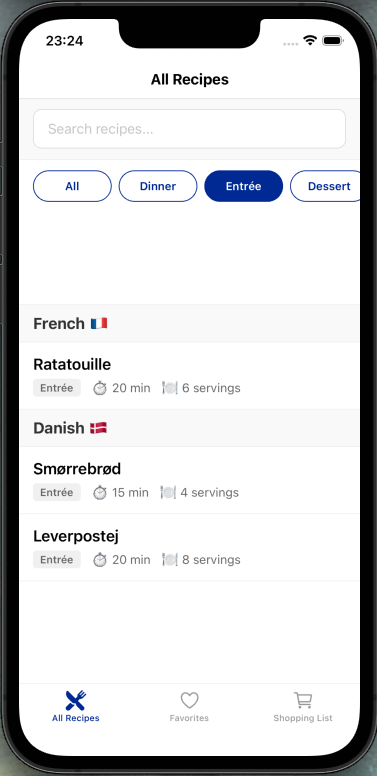
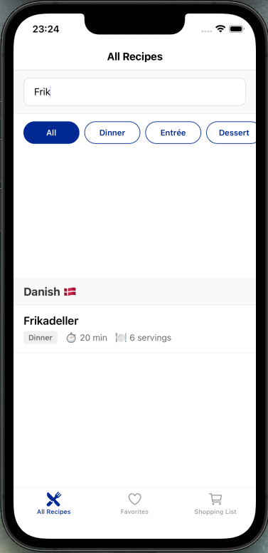
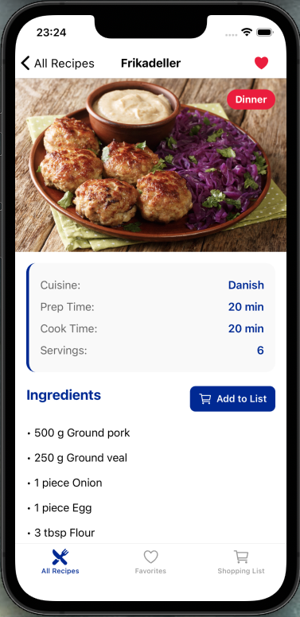

# Recipe Manager

A mobile recipe app for organizing my French and Danish recipes with favorites and a shopping list feature

## Architecture Overview

**Navigation:**
- 3 bottom tabs: All Recipes, Favorites, Shopping List
- Stack navigators for recipe details

**State Management:**
- Redux slices: recipes, favorites, shoppingList
- Async thunk for loading recipes
- AsyncStorage for persistence

**Native Integration:**
- Haptic feedback on favorite/cart actions

**Design:**
- Blue/white/red color theme
- Category filtering
- Animated heart icon

## Features Implemented

- Browse recipes organized by cuisine (French 🇫🇷 & Danish 🇩🇰)
- Filter by category (Dinner, Entrée, Dessert)
- Search recipes by name
- Save favorite recipes
- Add recipe ingredients to shopping list
- Persistent storage (favorites and shopping list saved between sessions)
- Pull-to-refresh to reload recipes
- Haptic feedback on interactions

## Known Limitations

- Simulated API loading (1 second delay)
- 10% random error chance for testing error states

## Screenshots

